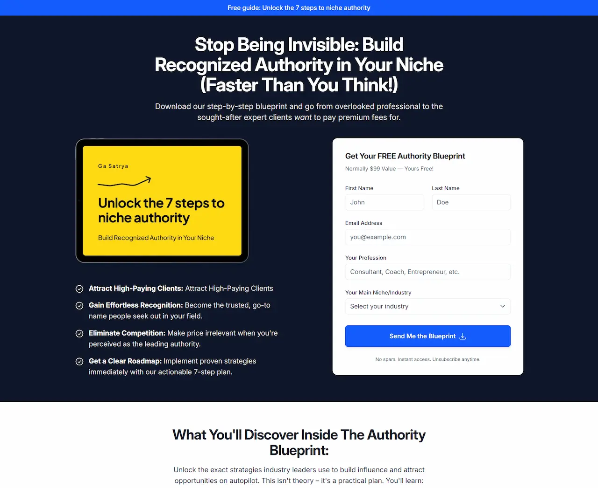

# Lead Magnet Landing Page

Demo: [https://ebook-lead-magnet.netlify.app/](https://ebook-lead-magnet.netlify.app/)

A high-converting lead generation landing page designed to capture email addresses in exchange for a premium ebook. This page implements the Psychology of Progressive Persuasion methodology with a mobile-first, WCAG 2.1 AA compliant design.

**Key Features:**

- Strategic Z-pattern visual hierarchy for optimal user engagement
- Benefit-focused copywriting with action-oriented CTAs
- Multiple conversion points strategically placed throughout the journey
- Social proof integration with authentic testimonials
- Clear value proposition and minimal friction in the conversion path

## HTML Version

If you need the HTML version of this landing page, download or clone this repository and check the `dist` folder for the compiled HTML files.

